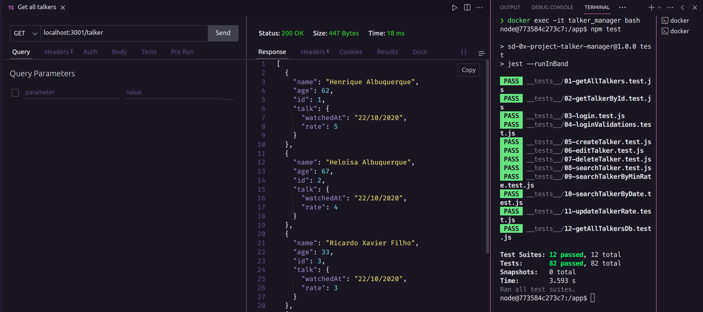

# Talker Manager Project 🗣️



## Descrição do Projeto

Este repositório contém um projeto focado na construção de uma aplicação de palestrantes (talkers) utilizando Node.js com Express para a criação de uma API REST. O objetivo é a manipulação de dados através das operações CRUD (Create, Read, Update e Delete). A manipulação de dados é realizada com um JSON, mas a última realiza uma consulta em um banco de dados MySQL.

### Tecnologias utilizadas


### O que aprendi

- Manipular dados locais ou em banco de dados MYSQL
- Validar dados em requisições (headers, body, query)
- Configurar uma aplicação Back-end
- Criação de rotas

## Executar o projeto

1. Em um diretório, clonar o repositório (SSH key):

  ```bash
  git clone https://github.com/yagobmoreira/talker-manager
  ```

2. Instalar as dependências:
  ```bash
  npm install
  ```
3. Iniciar os containers Docker: 
  ```bash
  docker compose up -d
  docker exec -it talker_manager bash
  npm start
  ```
4. Testes:
  ```bash
  npm test
  ```
  ```bash
  npm run lint
  ```
## Contribuições

[Yago Moreira](https://www.linkedin.com/in/yagobmoreira/) - /db - /middlewares - /routes - /utils

[Trybe](https://www.betrybe.com/) - Everything else